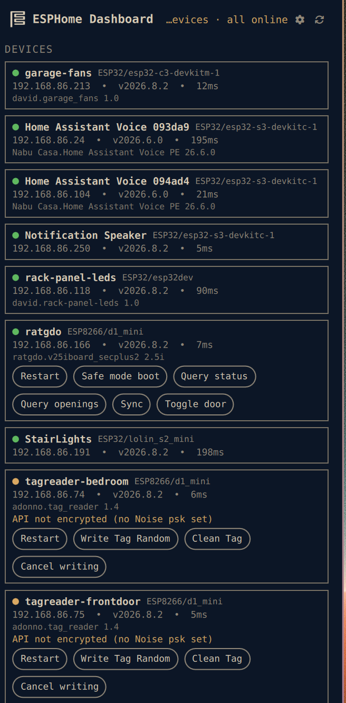

# ESPHome Dashboard

An [Omarchy](https://omarchy.org) shell plugin showing the live status of
your ESPHome device fleet in the bar.

Every ESPHome device advertises itself over mDNS (`_esphomelib._tcp`, the
same service Home Assistant uses to find it) — the plugin discovers your
whole fleet that way, with **no configuration and no credentials**, then
TCP-checks each device's API port so the count reflects who's actually
reachable right now rather than a stale mDNS cache.



## What it does

**Bar pill** — `online/total` device count. Turns accent when any reachable
device has no API encryption set, urgent when a device is confirmed offline
(missed `confirmMisses` polls in a row, not just one — a battery/deep-sleep
node that naps between readings isn't a fault).

**Popup** — every device: name, platform/board, ESPHome firmware version,
live online/offline dot, latency, and an "API not encrypted" flag where it
applies (worth knowing before you expose anything to the internet).

**Notifications** — a headless service polls the fleet and notifies when a
device goes offline (confirmed, not on the first missed poll), comes back,
or is seen for the first time. The three event classes — `offline`, `online`,
`new` — toggle independently.

## Requirements

- Node.js — `omarchy pkg add nodejs`. The popup tells you if it is missing.
- `avahi-browse` (mDNS) — Omarchy already installs and enables Avahi for
  printer/network discovery, so this is normally already there.

## Install

```bash
git clone https://github.com/dreed47/omarchy-esphome-dashboard \
  ~/.config/omarchy/plugins/esphome-dashboard
omarchy restart shell
```

Then add **ESPHome Dashboard** to the bar from the shell's widget menu.

## Remove

```bash
rm -rf ~/.config/omarchy/plugins/esphome-dashboard
omarchy restart shell
```

Optional leftover: `~/.config/omarchy/esphome-dashboard/` (settings).

## Settings

Set from the widget's entry in `shell.json`, or in
`~/.config/omarchy/esphome-dashboard/config.json`:

| key | default | meaning |
|---|---|---|
| `pollSeconds` | `30` | rescan + health-check interval (minimum 10) |
| `healthTimeoutMs` | `1500` | per-device TCP health-check timeout |
| `confirmMisses` | `2` | consecutive missed polls before a device counts as really offline |
| `notify` | `on` | desktop notifications on/off |
| `notifyTypes` | `offline,online,new` | which events notify, or `all` |
| `notifyTimeoutSeconds` | `0` | auto-dismiss after N seconds (0 = daemon default) |
| `hideNames` | `""` | comma-separated mDNS names to ignore |
| `debug` | `off` | log raw CLI output to the shell log |

## How it works

All mDNS and network access lives in one Node CLI, `bin/esphome-dashboard`.
The bar widget and the headless `Service.qml` both shell out to it — nothing
touches the network directly from QML. Parsing is pure and unit-tested
(`npm test`); system calls are isolated in `lib/io.mjs`.

```
esphome-dashboard status   --json     overview the pill/popup render from
esphome-dashboard devices  --json     mDNS discovery only, no health probe
esphome-dashboard ping     --host IP [--port 6053] [--timeout ms] --json
```

Offline confirmation (`confirmMisses`) and new/recovered-device notification
diffing live in `Service.qml`, persisted across shell reloads, the same way
Print Center debounces printer state — the CLI always reports the instant
truth; the service decides what's worth an alert.

## License

MIT
